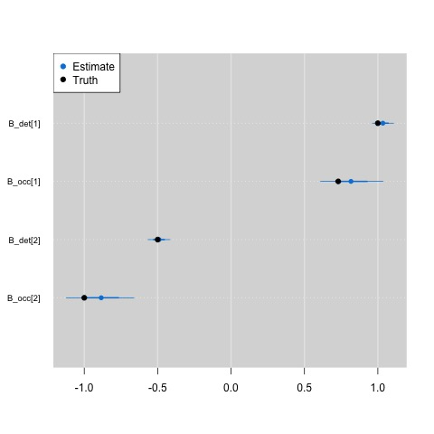

# jags ragged array

Often times sampling is not uniform across sites, such that 
the number of repeat visits across sampling sites varies. 
When there are not many sites or visits this may not matter
when modeling the data, you simply fill the detection / 
non-detection matrix with `NA` values where you lack
the data. However, when working with very large data sets
this can cause some issues. At best, the model compiles but
takes much longer to run because of all the `NA` nodes it
has to estimate. At worst, you may not have enough RAM to 
hold the model in your memory.

If you have a lot of missing data it may be simpler to model
the detection non-detection data in long-format (or a ragged array). `JAGS` does not allow for ragged arrays, but you can mimic them with the use of nested indexing in `JAGS`. The scripts
here illustrate how you can do this.

- ragged_array.R: This script simulates some detection / 
non-detection data and then incorporates a lot of missing data to 
mimic uneven sampling across sites. We then convert the 
detection / non-detection matrix and the detection covariates (which
vary by site-visit) to long format to be analyzed in `JAGS`.

- ragged_occupancy.R: This is the JAGS model fit to the data. The
only difference relative to your standard single-season occupancy
model is the format of the detection model. Instead of looping through
sites and visits it loops through each individual data point.

```R
  for(j in 1:nvisits){
    logit(rho[j]) <- inprod(B_det, X_det[j,])
    y[j] ~ dbern(rho[j] * z[site_id[j]])
  }
```

The nested indexing is from the additional vector `site_id` we
added into the model. It connects the long-format detection data
to the occupancy status of the species at the site.


Writing your model up in this fashion could potentially speed up
your model runs.

<div align="center"></div>


 
